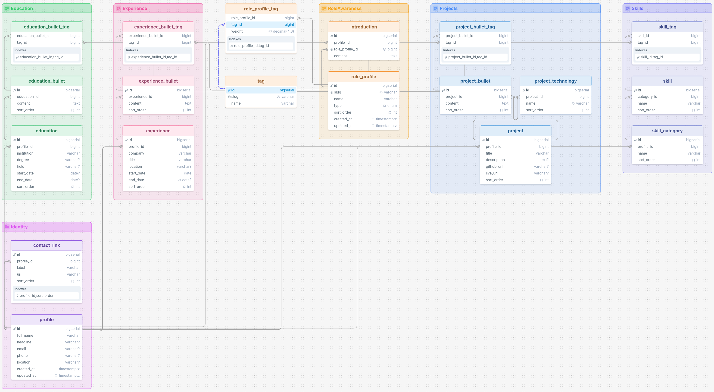
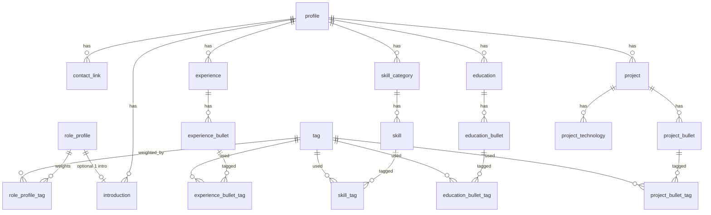

# CV database schema (issue #10)

Concrete schema reflecting what we’ve locked in: bullets on experience/education/projects, introductions FK’d to role profiles, tags included now (including on project bullets), single language for now.

## Diagram



## Entity overview

```text
profile
├── contact_link
├── introduction ──────────────► role_profile
├── experience
│     └── experience_bullet ───► tag (M2M)
├── education
│     └── education_bullet ────► tag (M2M)
├── skill_category
│     └── skill ───────────────► tag (M2M)
└── project
      ├── project_bullet ──────► tag (M2M)
      └── project_technology     (display labels)

tag
role_profile
└── role_profile_tag ──────────► tag + weight
```

## ER sketch



## Tables

Use `BIGINT` identity PKs everywhere. One language only for now (no locale columns).

### Core identity

**`profile`** — one row for self

| Column | Type | Notes |
|--------|------|--------|
| `id` | BIGINT PK | |
| `full_name` | VARCHAR NOT NULL | |
| `headline` | VARCHAR | short tagline |
| `email` | VARCHAR | |
| `phone` | VARCHAR | |
| `location` | VARCHAR | |
| `created_at` / `updated_at` | TIMESTAMPTZ | |

**`contact_link`**

| Column | Type | Notes |
|--------|------|--------|
| `id` | BIGINT PK | |
| `profile_id` | FK → profile | |
| `label` | VARCHAR NOT NULL | e.g. GitHub, LinkedIn |
| `url` | VARCHAR NOT NULL | |
| `sort_order` | INT NOT NULL DEFAULT 0 | |

### Role awareness (included now)

**`tag`**

| Column | Type | Notes |
|--------|------|--------|
| `id` | BIGINT PK | |
| `slug` | VARCHAR NOT NULL UNIQUE | `java`, `spring`, `backend`, … |
| `name` | VARCHAR NOT NULL | display name |

**`role_profile`**

| Column | Type | Notes |
|--------|------|--------|
| `id` | BIGINT PK | |
| `slug` | VARCHAR NOT NULL UNIQUE | `general`, `java`, `backend`, … (URLs later) |
| `name` | VARCHAR NOT NULL | e.g. Java Developer |
| `type` | VARCHAR NOT NULL | `GENERAL` \| `PERMANENT` \| `VACANCY` |
| `sort_order` | INT NOT NULL DEFAULT 0 | selector order |
| `created_at` / `updated_at` | TIMESTAMPTZ | |

Constraints worth adding:

- at most one row with `type = 'GENERAL'`
- `GENERAL` is the default/hidden profile from AGENTS.md (app logic; optional DB check)

**`role_profile_tag`**

| Column | Type | Notes |
|--------|------|--------|
| `role_profile_id` | FK | |
| `tag_id` | FK | |
| `weight` | NUMERIC(4,3) NOT NULL | e.g. `1.000` … `0.000` |
| PRIMARY KEY `(role_profile_id, tag_id)` | | |

### Introductions (Option 2)

**`introduction`**

| Column | Type | Notes |
|--------|------|--------|
| `id` | BIGINT PK | |
| `profile_id` | FK → profile | |
| `role_profile_id` | FK → role_profile UNIQUE | one intro per role |
| `content` | TEXT NOT NULL | single paragraph (no bullets) |

### Experience

**`experience`**

| Column | Type | Notes |
|--------|------|--------|
| `id` | BIGINT PK | |
| `profile_id` | FK | |
| `company` | VARCHAR NOT NULL | |
| `title` | VARCHAR NOT NULL | |
| `location` | VARCHAR | |
| `start_date` | DATE NOT NULL | |
| `end_date` | DATE | null = current |
| `sort_order` | INT NOT NULL DEFAULT 0 | |

**`experience_bullet`**

| Column | Type | Notes |
|--------|------|--------|
| `id` | BIGINT PK | |
| `experience_id` | FK | |
| `content` | TEXT NOT NULL | |
| `sort_order` | INT NOT NULL DEFAULT 0 | |

**`experience_bullet_tag`** — `(experience_bullet_id, tag_id)` PK

### Education

**`education`**

| Column | Type | Notes |
|--------|------|--------|
| `id` | BIGINT PK | |
| `profile_id` | FK | |
| `institution` | VARCHAR NOT NULL | |
| `degree` | VARCHAR | BSc, MSc, … |
| `field` | VARCHAR | programme / major |
| `start_date` | DATE | |
| `end_date` | DATE | |
| `sort_order` | INT NOT NULL DEFAULT 0 | |

**`education_bullet`**

| Column | Type | Notes |
|--------|------|--------|
| `id` | BIGINT PK | |
| `education_id` | FK | |
| `content` | TEXT NOT NULL | courses, topics, achievements |
| `sort_order` | INT NOT NULL DEFAULT 0 | |

**`education_bullet_tag`** — `(education_bullet_id, tag_id)` PK

(#34 lists skills/experience bullets/projects; education bullets are included for role-aware topic ordering.)

### Skills

**`skill_category`**

| Column | Type | Notes |
|--------|------|--------|
| `id` | BIGINT PK | |
| `profile_id` | FK | |
| `name` | VARCHAR NOT NULL | Backend, Frontend, … |
| `sort_order` | INT NOT NULL DEFAULT 0 | |

**`skill`**

| Column | Type | Notes |
|--------|------|--------|
| `id` | BIGINT PK | |
| `category_id` | FK | |
| `name` | VARCHAR NOT NULL | Java, Spring Boot, … |
| `sort_order` | INT NOT NULL DEFAULT 0 | |

**`skill_tag`** — `(skill_id, tag_id)` PK

### Projects

**`project`**

| Column | Type | Notes |
|--------|------|--------|
| `id` | BIGINT PK | |
| `profile_id` | FK | |
| `title` | VARCHAR NOT NULL | |
| `description` | TEXT | short overview (optional) |
| `github_url` | VARCHAR | |
| `live_url` | VARCHAR | |
| `sort_order` | INT NOT NULL DEFAULT 0 | |

**`project_bullet`**

| Column | Type | Notes |
|--------|------|--------|
| `id` | BIGINT PK | |
| `project_id` | FK | |
| `content` | TEXT NOT NULL | |
| `sort_order` | INT NOT NULL DEFAULT 0 | |

**`project_technology`** — display chips on the project (not the relevance model)

| Column | Type | Notes |
|--------|------|--------|
| `id` | BIGINT PK | |
| `project_id` | FK | |
| `name` | VARCHAR NOT NULL | e.g. React, PostgreSQL |
| `sort_order` | INT NOT NULL DEFAULT 0 | |

**`project_bullet_tag`** — `(project_bullet_id, tag_id)` PK for relevance (aligned with experience/education bullets)

## Design notes

1. **`project_technology` vs tags** — technologies are for UI labels; tags on **project bullets** drive scoring. A project can show “React” as a chip and have bullets tagged `frontend` / `react`.
2. **No i18n columns** — add translation later when needed.
3. **No admin/user tables** — Epic 6.
4. **Vacancy profiles** — same `role_profile` + weights; extra vacancy metadata can wait until Epic 7.
5. **`profile_id` everywhere** — slightly redundant for a single CV, but keeps FKs clear and avoids a special-case “global” model.

## Suggested split for issues

| Issue | Work |
|-------|------|
| **#10** | This schema (agree / document) |
| **#11** | Flyway `V2__...sql` creating these tables |

## DrawSQL / DBML

Paste into [DrawSQL](https://drawsql.app/draw) via File → Import (PostgreSQL).

```dbml
// CV schema design for issue #10
// Single language for now; i18n later via Flyway

Enum role_profile_type {
  GENERAL
  PERMANENT
  VACANCY
}

TableGroup Identity {
  profile
  contact_link
}

TableGroup RoleAwareness {
  tag
  role_profile
  role_profile_tag
  introduction
}

TableGroup Experience {
  experience
  experience_bullet
  experience_bullet_tag
}

TableGroup Education {
  education
  education_bullet
  education_bullet_tag
}

TableGroup Skills {
  skill_category
  skill
  skill_tag
}

TableGroup Projects {
  project
  project_bullet
  project_technology
  project_bullet_tag
}

Table profile {
  id bigint [pk, increment]
  full_name varchar [not null]
  headline varchar
  email varchar
  phone varchar
  location varchar
  created_at timestamptz [not null, default: `now()`]
  updated_at timestamptz [not null, default: `now()`]
}

Table contact_link {
  id bigint [pk, increment]
  profile_id bigint [not null]
  label varchar [not null]
  url varchar [not null]
  sort_order int [not null, default: 0]

  Indexes {
    (profile_id, sort_order)
  }
}

Table tag {
  id bigint [pk, increment]
  slug varchar [not null, unique, note: 'java, spring, backend, ...']
  name varchar [not null]
}

Table role_profile {
  id bigint [pk, increment]
  slug varchar [not null, unique, note: 'general, java, backend, ...']
  name varchar [not null]
  type role_profile_type [not null]
  sort_order int [not null, default: 0]
  created_at timestamptz [not null, default: `now()`]
  updated_at timestamptz [not null, default: `now()`]
}

Table role_profile_tag {
  role_profile_id bigint [not null]
  tag_id bigint [not null]
  weight decimal(4,3) [not null, note: 'e.g. 1.000 .. 0.000']

  Indexes {
    (role_profile_id, tag_id) [pk]
  }
}

Table introduction {
  id bigint [pk, increment]
  profile_id bigint [not null]
  role_profile_id bigint [not null, unique, note: 'one intro per role profile']
  content text [not null]
}

Table experience {
  id bigint [pk, increment]
  profile_id bigint [not null]
  company varchar [not null]
  title varchar [not null]
  location varchar
  start_date date [not null]
  end_date date [note: 'null = current']
  sort_order int [not null, default: 0]
}

Table experience_bullet {
  id bigint [pk, increment]
  experience_id bigint [not null]
  content text [not null]
  sort_order int [not null, default: 0]
}

Table experience_bullet_tag {
  experience_bullet_id bigint [not null]
  tag_id bigint [not null]

  Indexes {
    (experience_bullet_id, tag_id) [pk]
  }
}

Table education {
  id bigint [pk, increment]
  profile_id bigint [not null]
  institution varchar [not null]
  degree varchar
  field varchar
  start_date date
  end_date date
  sort_order int [not null, default: 0]
}

Table education_bullet {
  id bigint [pk, increment]
  education_id bigint [not null]
  content text [not null]
  sort_order int [not null, default: 0]
}

Table education_bullet_tag {
  education_bullet_id bigint [not null]
  tag_id bigint [not null]

  Indexes {
    (education_bullet_id, tag_id) [pk]
  }
}

Table skill_category {
  id bigint [pk, increment]
  profile_id bigint [not null]
  name varchar [not null]
  sort_order int [not null, default: 0]
}

Table skill {
  id bigint [pk, increment]
  category_id bigint [not null]
  name varchar [not null]
  sort_order int [not null, default: 0]
}

Table skill_tag {
  skill_id bigint [not null]
  tag_id bigint [not null]

  Indexes {
    (skill_id, tag_id) [pk]
  }
}

Table project {
  id bigint [pk, increment]
  profile_id bigint [not null]
  title varchar [not null]
  description text
  github_url varchar
  live_url varchar
  sort_order int [not null, default: 0]
}

Table project_bullet {
  id bigint [pk, increment]
  project_id bigint [not null]
  content text [not null]
  sort_order int [not null, default: 0]
}

Table project_technology {
  id bigint [pk, increment]
  project_id bigint [not null]
  name varchar [not null, note: 'display chip; relevance uses project_bullet_tag']
  sort_order int [not null, default: 0]
}

Table project_bullet_tag {
  project_bullet_id bigint [not null]
  tag_id bigint [not null]

  Indexes {
    (project_bullet_id, tag_id) [pk]
  }
}

// Relationships
Ref: contact_link.profile_id > profile.id
Ref: introduction.profile_id > profile.id
Ref: introduction.role_profile_id > role_profile.id

Ref: role_profile_tag.role_profile_id > role_profile.id
Ref: role_profile_tag.tag_id > tag.id

Ref: experience.profile_id > profile.id
Ref: experience_bullet.experience_id > experience.id
Ref: experience_bullet_tag.experience_bullet_id > experience_bullet.id
Ref: experience_bullet_tag.tag_id > tag.id

Ref: education.profile_id > profile.id
Ref: education_bullet.education_id > education.id
Ref: education_bullet_tag.education_bullet_id > education_bullet.id
Ref: education_bullet_tag.tag_id > tag.id

Ref: skill_category.profile_id > profile.id
Ref: skill.category_id > skill_category.id
Ref: skill_tag.skill_id > skill.id
Ref: skill_tag.tag_id > tag.id

Ref: project.profile_id > profile.id
Ref: project_bullet.project_id > project.id
Ref: project_technology.project_id > project.id
Ref: project_bullet_tag.project_bullet_id > project_bullet.id
Ref: project_bullet_tag.tag_id > tag.id
```
